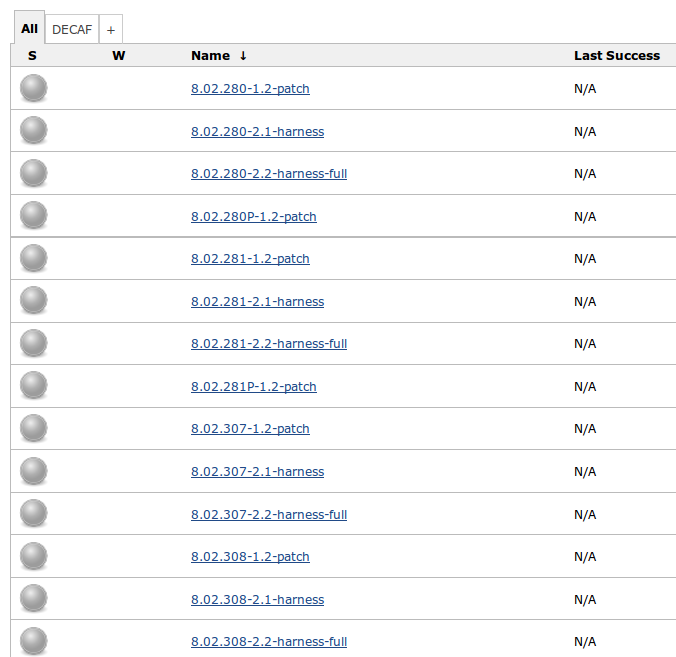
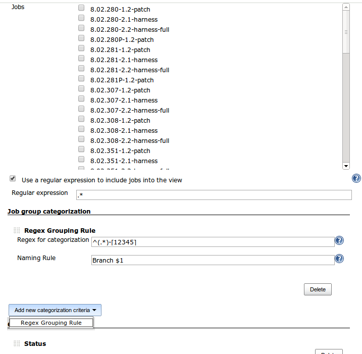
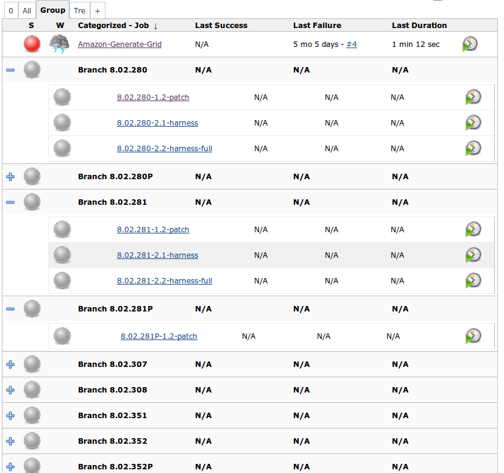

# Categorized View

Introduce a new kind of view where you can categorize groups of jobs under a single label
created by regular expressions or other criterias that can be implemented as extension points.

## Description

This plugin allows you to create a new view that is very similar to the standard Jenkins List Views,
but where you can group jobs and categorize them according to regular expressions.
The functionality is better explained with images.

Let's suppose you have several jobs with a common prefix,
such as the software version of a specific branch.
The versions follow a pattern.
For example, this is the usual "All" view for the jobs:

You start by creating a "Categorized Jobs View" from the view creation button,
and you will find the following new section (Job group categorization):

Besides the categorization configuration, all the other options apply without any changes.
After you create the view, the result will be the following:

That is, the jobs are now categorized under the labels derived from the regular expression.

## Usage

To create the view, just follow the usual procedure to add new views
and you will find a new type of view named "Categorized Jobs View".

The configuration page has a new section, "Job group categorization".
You can add as many expressions as you want.
For each expression, there are two fields:

- Regex for categorization: regular expression to match job names that will be part of this category
- Naming Rule: The name of the category. You can use $1 to use the match to create the category name.

You are not forced to use complex regular expressions.
Let's suppose you just want to add some specific jobs to a given category.
You can use the following:

- Regex for categorization: `^Name of Job 1\|Name of Job 2\|...$`
- Naming Rule: My Jobs

Just notice that I put ^ and $,
which are regular expressions meta symbols to match start and end of string.
You have to put it to make sure you won't get other jobs
whose name contains the jobs listed above (such as "foo Name of Job 1").

A few things to keep in mind:

- The groups are not mutually exclusive. It is possible for two distinct groups to have a non empty intersection of jobs.
- If you create multiple rules that map to the same group, it will be a single group. It won't create multiple groups with the same name (as expected)
